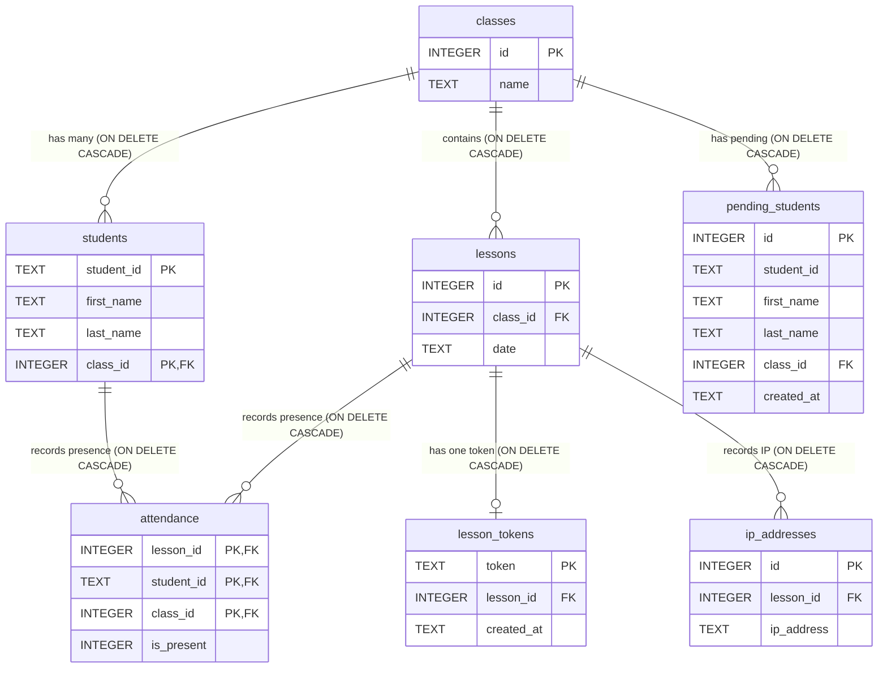

# 🎓 Herio Scholar: High-Security LAN Attendance Tracker (Electron Desktop App)

## 🌟 Project Vision

**Herio Scholar** is a robust, standalone **desktop application** designed to revolutionize attendance management in educational and organizational settings. Leveraging the power of **Electron** and the reliability of **Node.js/Express**, the application establishes a centralized **Local Area Network (LAN) server** on the instructor's PC.

This architecture guarantees: **maximum speed**, **total data privacy** (stored locally with SQLite), and an **extremely reliable attendance verification system** based on QR Codes and strict local network constraints.

***

## 🚀 Operational Flow and Core Features

Herio Scholar is a **self-hosted solution** that manages the entire lifecycle of the class session, from class creation to secure, automated student attendance registration.

### 1. 🖥️ Centralized Management & Architecture
The desktop application (built with **Electron**) provides a fast, native-like user interface, allowing the instructor to:
* **Manage Classes and Lessons:** Create, modify, and archive classes, student rosters, and lesson records efficiently.
* **SQLite Database:** All class data, student information, and attendance records are stored in a local, portable **SQLite database**, ensuring information remains private and easily transferable.
* **Integrated LAN Server:** The application automatically starts an HTTP/API server (Node.js/Express) **only accessible** by devices connected to the same Local Area Network (LAN).

### 2. 🔑 Student Self-Registration (QR Code Class-Joining)
To eliminate manual data entry and ensure data accuracy, the app supports student self-enrollment:
* Students scan a dedicated **registration QR Code** with their mobile device.
* They can then self-submit their student ID and name into the roster, automatically becoming part of the official class list (pending approval).

### 3. ✅ Secure Attendance Registration (QR Code Lesson Attendance)
For each lesson, the instructor generates a QR Code that serves as the access key:

* **Unique Token:** The QR Code embeds a unique, time-sensitive token tied specifically to that lesson.
* **Student Self-Attendance:** Students scan the code using any mobile device. The application receives the attendance request and updates the register.

### 4. 🛡️ Security and Multi-Factor Verification

The core strength of the system lies in its ability to leverage the LAN environment for enhanced verification, making attendance robust against fraud:

* **LAN Constraint:** The application **only functions** if the student's device is connected to the same Wi-Fi network as the instructor's PC (where the server resides). This verifies the student's **physical presence** in the study area.
* **Unique IP Address Logging:** When a student registers attendance for a lesson, the application records the **private IP address** of their device.
    * **Anti-Frode:** This mechanism ensures that **a single device** (based on the IP address) can register attendance **only once** for that lesson. This prevents a present student from registering multiple absent classmates from the same phone.

***

### Database Schema Overview (SQLite)

The application uses a relational schema designed for speed and data integrity, managed via SQLite.



## Build instructions

To create a local build of **Herio Scholar**:

1. **Clone the repository**:

```bash
git clone https://github.com/GiovanniPanizzi/herio-scholar-attendance-tracker.git
cd herio-scholar-attendance-tracker
```

2. **Install dependencies**:
```bash
npm install
```

3. **Start the app in development mode**:
```bash
npm start
```

4. **Generate a release-ready build**:
```bash
npm run make
```

The generated files will be located in the out/make/ directory for each operating system:

macOS: .zip or .dmg

Windows: .exe and .zip

Linux: .deb or .rpm

