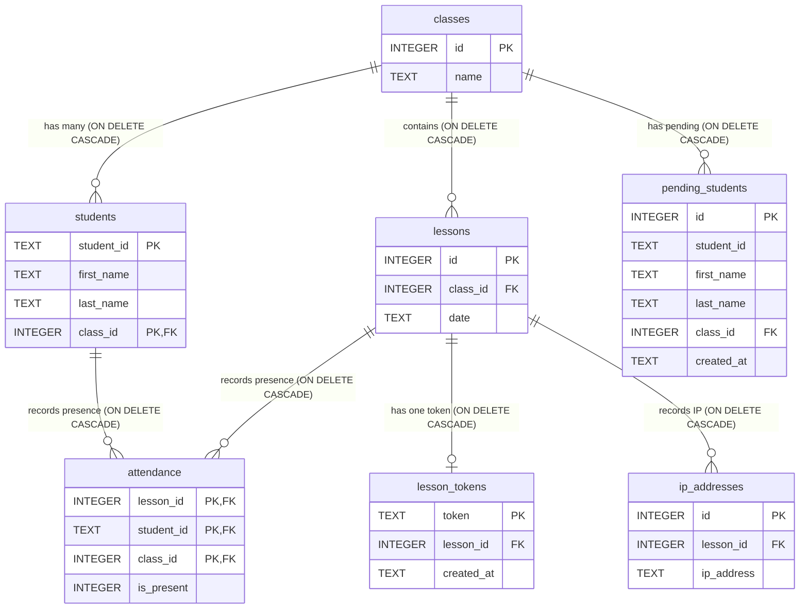

# Herio Scholar: LAN Attendance Tracker (Electron Desktop App)

****

### 🌟 Project Description

**Herio Scholar** is a robust, cross-platform **desktop application** designed for efficient **attendance tracking** in educational or organizational settings. Built using **Electron** and **Node.js**, it operates entirely on a **Local Area Network (LAN)**, providing a self-hosted, centralized system without requiring an external internet connection or cloud services. Attendance data for multiple classes is stored securely in a local **SQLite database**.

This architecture makes Herio ideal for environments requiring quick, reliable, and private data management.

---

### 🚀 Key Features

* **Offline LAN Operation:** The application is self-contained and runs on a local server (Node.js/Express) accessible only via the LAN, guaranteeing speed and data privacy.
* **Electron Desktop Client:** Provides a fast, native-like user experience on Windows, macOS, and Linux for managing classes, students, and sessions.
* **QR Code-Based Attendance:** Generates a unique, time-limited QR code for each lesson. Students simply scan the code using any mobile device to quickly and accurately register their presence.
* **Multi-Class Management:** Manage multiple independent classes and their student rosters efficiently within the application.
* **SQLite Database:** All class data, student information, and attendance records are stored locally in a single, portable SQLite database, simplifying backup and migration.
* **IP Address Logging:** For enhanced security and audit trails, the application records the IP address from which the attendance was registered.

### Database Schema Overview (SQLite)

The application uses a relational schema designed for speed and data integrity, managed via SQLite.



## Build instructions

To create a local build of **Herio Scholar**:

1. **Clone the repository**:

```bash
git clone https://github.com/GiovanniPanizzi/herio-attendance-tracker.git
cd herio-scholar-attendance-tracker
```

2. **Install dependencies**:
```bash
npm install
```

3. **Start the app in development mode**:
```bash
npm start
```

4. **Generate a release-ready build**:
```bash
npm run make
```

The generated files will be located in the out/make/ directory for each operating system:

macOS: .zip or .dmg

Windows: .exe and .zip

Linux: .deb or .rpm

